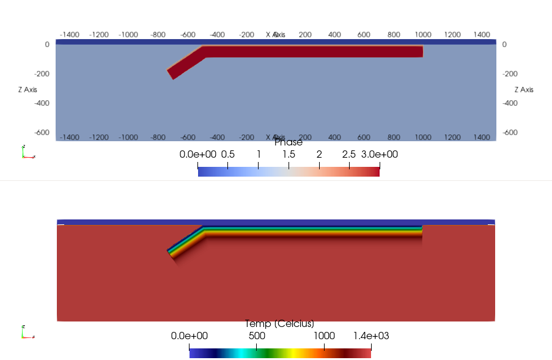

[TOC]
# 3.2 Generating a model setup with Julia

In many cases, generating a model setup from within the LaMEM input file using built-in geometries is insufficient and we would like to have more control on what we are doing & create more complicated setups.

One way to do this is to use a Julia script to generate the model setup. This is the recommended way to do this. We have provided example files in `/examples/SubductionWithParticles/`, as well as in some of the test directories. The Julia setup scripts are heavily based on the utilities from the [GeophysicalModelGenerator package](https://github.com/JuliaGeodynamics/GeophysicalModelGenerator.jl) to facilitate specification of model geometry and initial fields such as temperature.

Depending on whether your LaMEM simulation will run in parallel or not there are two different approaches: 

1. Create the full setup on one processor. For this, the Julia scripts should be placed in the same directory as the LaMEM `(*.dat)` input file. 

2. By creating a `parallel partitioning file` which allows creating a parallel input file. With this method, every processor of a parallel LaMEM simulation only reads in the piece of the input geometry it needs. This method is scalable to very high resolutions, but requires you to run LaMEM first to create the partitioning file.   
   
If you start with a new setup/project, we recommend that you first generate the input file on one processor, and look at it using Paraview (approach 1). Once you are happy with it, you can proceed with approach 2.

Let's have a look at how these two approaches work, using the input files in `/examples/SubductionWithParticles` as an example.

The files in this directory create a setup for a subduction model with free slip and no temperature.

### 3.2.1. Generate the input on a single processor

The file `CreateMarkers_Subduction_Linear_FreeSlip_parallel.jl` gives an example of how we can generate an input file on one processor.

Execute the script without providing any command line options
```
julia CreateMarkers_Subduction_Linear_FreeSlip_parallel.jl 

```
This will put the marker files in the directory `/markers`. 
Within the LaMEM input file, you indicate that this directory should be used with

```
msetup          =   files            
mark_load_file  =   ./markers/mdb     # marker input file (extension is .xxxxxxxx.dat)
```
The script will also generate a VTS file `LaMEM_ModelSetup.vts` that contains the input geometry and temperature structure, so you can check it is correct, before running a simulation.

Once you are happy, you can run LaMEM on one processor with

```
../../bin/opt/LaMEM -ParamFile Subduction2D_FreeSlip_Particles_Linear_DirectSolver.dat
```

Interested in how to do the same on >1 processor? 
Keep on reading...

### 3.2.2. Generating parallel input using partitioning files

Generating parallel input files involves 3 steps:
1. Create a **ProcessorPartitioning** file for a specific number of processors, which basically tells how LaMEM divides the computational box over the various processors.
2. Run the Julia script that generates the input geometry file, using this **ProcessorPartitioning** file as input. In this case, you need to provide the file name as a command line option.
3. Run the LaMEM simulation in parallel, using the same number of processors as used to create the partitioning file.  

In the following we will describe the 3 steps with an example. We will assume that you are happy with generating the setup on one processor (see above). 

#### 3.2.2.1 Create the partitioning file

Make sure that you are in the correct directory:
```
$ cd /examples/SubductionWithParticles

```
We again use `Subduction2D_FreeSlip_Particles_Linear_DirectSolver.dat` as the LaMEM input file.

First, run this file with LaMEM, but with the added command-line parameter `-mode save_grid`
```
$ mpiexec -n 4 ../../bin/opt/LaMEM -ParamFile Subduction2D_FreeSlip_Particles_Linear_DirectSolver.dat -mode save_grid
```
This will generate a processor partitioning file `ProcessorPartitioning_4cpu_4.1.1.bin`, which we need to provide to the Julia script.
If you generate the file on a different number of processors, or use different box-sizes, the naming of the partitioning file will be different.

#### 3.2.2.2 Run the Julia script

Execute the Julia script again, but this time provide the name of the partitioning file as a command ine option
```
julia CreateMarkers_Subduction_Linear_FreeSlip_parallel.jl ProcessorPartitioning_4cpu_4.1.1.bin
```
Once you run this file, it should give the following output:

```
% julia CreateMarkers_Subduction_Linear_FreeSlip_parallel.jl ProcessorPartitioning_4cpu_4.1.1.bin
Saved file: LaMEM_ModelSetup.vts
Field :APS is not provided; setting it to zero
(Nprocx, Nprocy, Nprocz, xc, yc, zc, nNodeX, nNodeY, nNodeZ) = (4, 1, 1, [-1500.0, -750.0, 0.0, 750.0, 1500.0], [0.0, 10.0], [-660.0, 0.0], 257, 3, 65)
Writing LaMEM marker file -> ./markers/mdb.00000000.dat
Writing LaMEM marker file -> ./markers/mdb.00000001.dat
Writing LaMEM marker file -> ./markers/mdb.00000002.dat
Writing LaMEM marker file -> ./markers/mdb.00000003.dat
```
which shows that it created marker files for 4 processors.

If you open the file `LaMEM_ModelSetup.vts` in ParaView, it should look like:



Which is a subduction setup as in the example before. 

#### 3.2.2.3 Perform the parallel LaMEM simulation
Once you successfully created the marker files, you can run the LaMEM simulation in parallel with:
```
mpiexec -n 4 ../../bin/opt/LaMEM -ParamFile Subduction2D_FreeSlip_Particles_Linear_DirectSolver.dat
```

Please remember that you need to re-generate the partitioning file if you:
1. Change the number of elements in any of the directions
2. Change the number of particles/element
3. Change the dimensions of the grid (length, width, bottom, etc.)

If you only change the internal geometry or, say, the temperature of the slab, you do **not** need to redo the partitioning file.
Simply rerunning the Julia script is OK in that case. 


