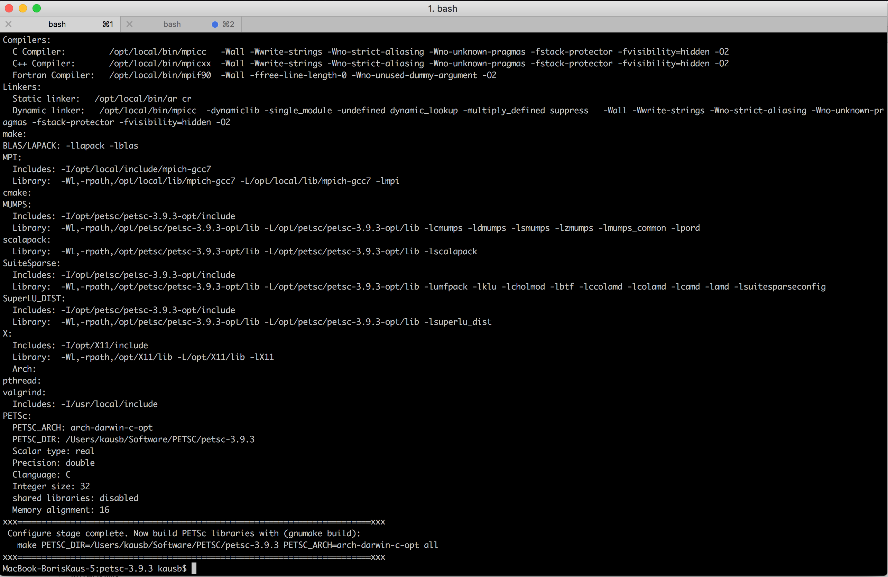
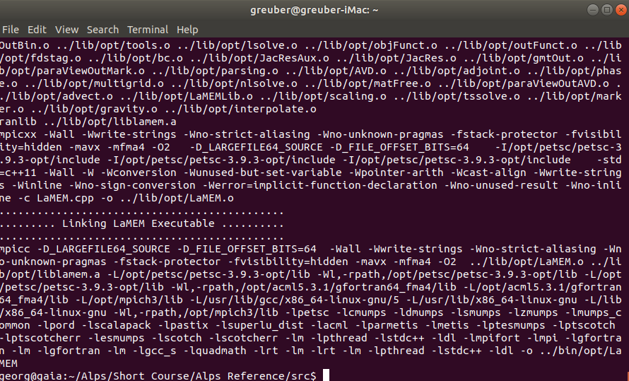
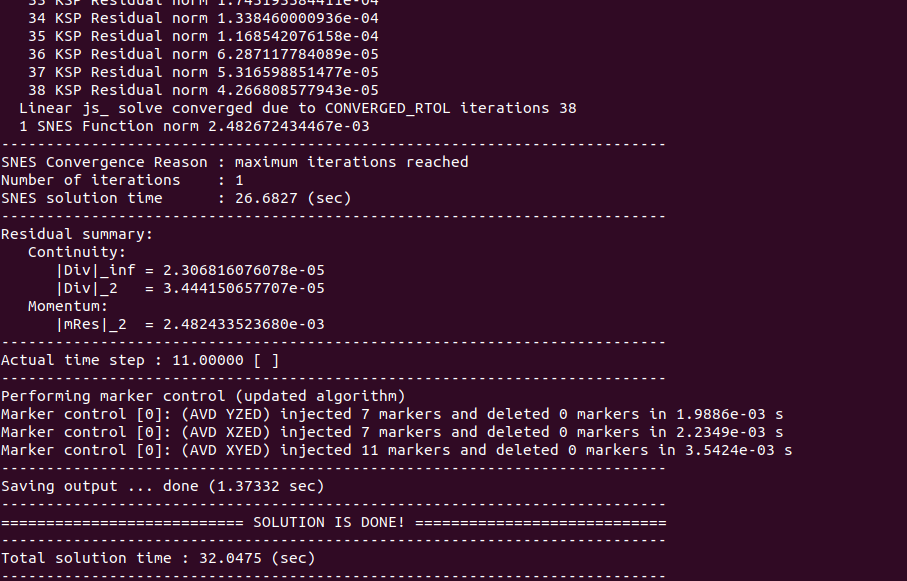
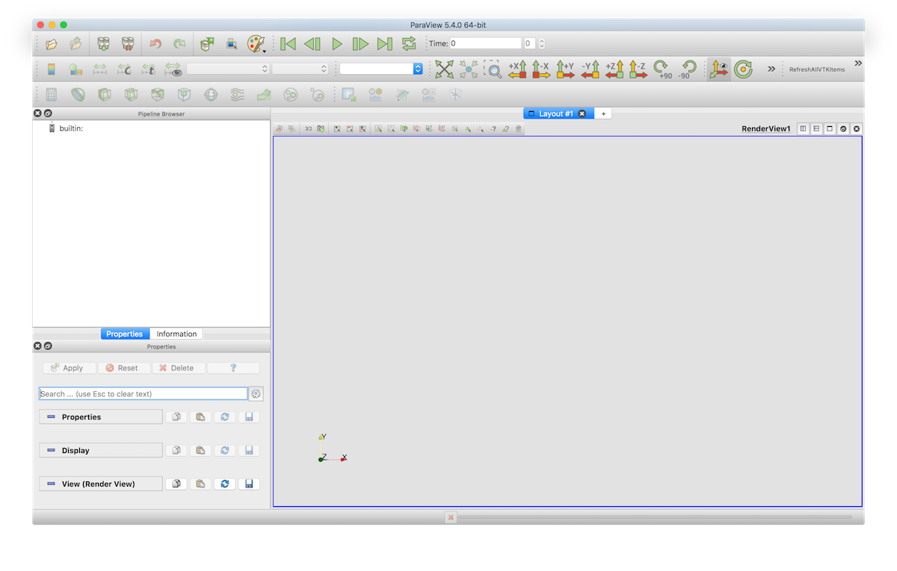

# Installation

# 1.0 Precompiled binaries
The absolute simplest way to get LaMEM working on your system is to download pre-compiled libraries which are available for over 100 architectures and systems, including essentially all systems in use at the moment. You can install it through the julia package manager, and you can run it either through julia or through the terminal (after setting the correct path):
```julia
julia> ]
pkg> add LaMEM
pkg> test LaMEM
```
More details are given [here](https://github.com/JuliaGeodynamics/LaMEM.jl).
This will work fine on your local machine or server (including in parallel). Yet, if you are planning to use LaMEM on large parallel HPC clusters you (or your system administrator) may still need to compile PETSc.

# 1.1 Installation from source

LaMEM is build in top of [PETSc](http://www.mcs.anl.gov/petsc/), which provides great support for parallel solvers and grid infrastructure. Different than other codes used in geodynamics, LaMEM does not require an excessive amount of additional packages, except for the ones that can be downloaded through the PETSc installation system. 

This installation guide was created based on initial input from Giovanni Mainetti and Andrea Bistacchi (University of Milano Bicocca), with input from the Mainz team (Andrea Picollo, Boris Kaus).

The LaMEM development team uses different approaches internally, and over years many aspects of installing PETSc and using LaMEM become easier. Yet if you ask us now (october 2020), what we recommend when you are a new user it would be the following:

1. [PETSc](http://www.mcs.anl.gov/petsc/download/index.html) using the correct version, including the external packages SUPERLU_DIST, MUMPS, PASTIX and UMFPACK (Suitesparse). These are all direct solvers that we use for 2D simulations, or as coarse grid solvers, so they are useful to have. If you happen to have compilation errors with some of them (e.g., mumps), it is also ok to only have one direct solver.
2. [Julia](https://julialang.org/), to run the LaMEM testing suite. 
3. [Microsoft Visual Studio Code](https://code.visualstudio.com), which is by far the best debugger/development environment at the moment. Useful plugins: [C/C++ with Intellisense](https://marketplace.visualstudio.com/items?itemName=ms-vscode.cpptools) (debugging LaMEM code), [Julia](https://marketplace.visualstudio.com/items?itemName=julialang.language-julia), [Remote SSH](https://marketplace.visualstudio.com/items?itemName=ms-vscode-remote.remote-ssh) (great if you want to change LaMEM inut scripts on a remote server)
4. [Paraview](https://www.paraview.org) for visualizations.   


## 1.1.1 Prerequisites
We have tested LaMEM on Linux, Mac and Windows 10. The development team uses Mac and Linux, so these machines are best supported. As Windows 10 now has a (still experimental) bash shell (called WLS), you can install PETSc within this shell by following the Linux installation instructions.

## 1.1.2 Automated PETSc installation using Spack
The most complicated step in getting LaMEM running is to install the correct version of PETSc, on your laptop or cluster. Below we give more specific info if you want to do it yourself on Mac or Linux. 
Yet, an alternative and newer method to install PETSc and all required compilers on a new (linux/mac) machine or even on a complicated cluster is [spack](https://spack.io). It installs everything required and consistently with the same compilers in a separate directory and works quite well in our experience (including installing additional packages). 
A spack tutorial can be found [here](https://spack-tutorial.readthedocs.io/en/latest/). 

*Brief instructions:*
You can install spack in your home directory with:
```
$ git clone https://github.com/spack/spack.git ~/spack
$ cd ~/spack
```
And add environmental variables:
```
$ . share/spack/setup-env.sh 
```
Find the compilers you have
```
$ spack compilers
```
Get info about the PETSc package that you can install:
```
$ spack info petsc
```
Install PETSc with the correct packages, and leave out stuff we don't need. The optimized compilation of PETSc is installed with
```
$ spack install petsc@3.22.5 +mumps +suite-sparse +superlu-dist ~hypre ~hdf5 ~shared ~debug
```
If that works out, you'll have to update your environmental variables and create the `PETSC_OPT` variable
```
$ . share/spack/setup-env.sh 
$ export PETSC_OPT=$(spack location -i petsc)       
``` 
You would have to redo the same for a debug version of PETSc to have the full compilation up and running. 


## 1.1.3 Manual PETSc installation
The alterative method is to install PETSc yourself. That is a bit more effort, but also enables you to install packages (like Pastix), that are not available in the spack distribution. Below we have installation instructions for Mac and Linux. On Windows, uses the WSL and follow the linux instructions.

### 1.1.3.1 Julia
Make sure that both Julia is installed, for example by typing 
```
$ which julia
```
If it is not installed get it form [here](https://julialang.org/downloads/)

### 1.1.3.2 Compilers and various other packages
PETSc will need fortran and C compilers. Which fortran compiler you use is not all that important, so you are welcome to use gcc and gfortran. Once you are a more experienced LaMEM user and do production runs, you might want to try different options to see if this speeds up the simulations. In addition to the compilers, it is a good idea to install git and cmake as well. 

On Linux this can be done with
```
$ sudo apt update
$ sudo apt install build-essential gfortran python numpy
$ sudo apt install bison flex cmake git-all valgrind
$ sudo apt-get install libtool libtool-bin
```
and on Mac, using Homebrew

```
$ brew install gfortran 
$ brew install make 
$ brew install bison
brew install mpich

```

### 1.1.3.3 PETSc
The most important package for LaMEM is PETSc. If you just want to give LaMEM a try, the most basic installation is sufficient. Once you do production runs, it is worthwhile to experiment a bit with more optimized solver options. Installing PETSc with those does not always work, but PETSc has a very responsive user list which is searchable, and where you can post your questions if needed. 
As PETSc regularly changes its syntax, LaMEM is always only compatible with a particular version of PETSc. This is typically updated once per year. 

The current version of LaMEM is compatible with **PETSc 3.22.5** 
We have also successfully compiled LaMEM with PETSc 3.23.x so you are also welcome to use that, but our Github actions CI testing environment uses 3.22.5 at the moment. 

You can download the PETSc version you need [here](http://www.mcs.anl.gov/petsc/download/index.html). Do that and unzip it with
```
$ tar -xvf petsc-3.22.5.tar.gz
```

Change to the PETSc directory from the command window, for example with:
```
$ cd petsc-3.22.5
```

Example of PETSc configuration command is provided below:

```
$ ./configure \
--prefix=/Users/USERNAME/SOFT/petsc/petsc-3.22.5-opt \
--COPTFLAGS="-O2" \
--FOPTFLAGS="-O2" \
--CXXOPTFLAGS="-O2" \
--with-debugging=0 \
--with-large-file-io=1 \
--with-c++-support=1 \
--with-cc=mpicc \
--with-cxx=mpicxx \
--with-fc=mpif90 \
--download-openblas \
--download-metis=1 \
--download-parmetis=1 \
--download-scalapack=1 \
--download-mumps=1 \
--download-superlu_dist=1 \
--with-clean
```
This will install an optimized (fast) version of PETSc on your system in the directory `/Users/USERNAME/Software/PETSC/petsc-3.22.5-opt`. You can change this directory, obviously, but in that case please remember where you put it as we need it later. Both parallel direct solvers MUMPS and SUPERLU_DIST will be configured. LaMEM will also work without these parallel solvers, but we find them particularly useful for 2D simulations and as coarse grid solvers.

After the configuration step has finished successfully (which will take some time), it should look something like


Just follow the suggestions on the screen to build and install PETSc as well as to run a couple of tests to make sure that installation works.

If you only run simulations with LaMEM, the optimized version of PETSc described above will be sufficient. Yet, if you also develop routines and have to do debugging, it is a good idea to also install the debug version:

```
$ ./configure \
--prefix=Users/USERNAME/Software/PETSC/petsc-3.22.5-deb \
--COPTFLAGS="-g -O0" \
--FOPTFLAGS="-g -O0" \
--CXXOPTFLAGS="-g -O0" \
--with-debugging=1 \
--with-large-file-io=1 \
--with-c++-support=1 \
--with-cc=mpicc \
--with-cxx=mpicxx \
--with-fc=mpif90 \
--download-openblas \
--download-metis=1 \
--download-parmetis=1 \
--download-scalapack=1 \
--download-mumps=1 \
--download-superlu_dist=1 \
--with-clean
```
Compared to before, we have three changes, namely: 

1) That the prefix (or the directory where PETSc will be put) is changed to `--prefix=Users/USERNAME/Software/PETSC/petsc-3.22.5-deb` 
2) We tell it to compile a debug version of PETSc with  `--with-debugging=1`
3) We change the optimization flags to `--FOPTFLAGS="-O0 -g" --CXXOPTFLAGS="-O0 -g" --COPTFLAGS="-O0 -g"`

More detailed information about configuration on diffrent platforms can be found in `LaMEM/info/installation` folder.

## 1.1.4 Installing PETSc on a cluster
Chances exists that you want to install PETSc on a cluster. The main point to take into account is that you need to link it against the appropriate MPI compilers. 

If you are lucky, a previous version of PETSc exists already on the cluster and you want to reinstall it in your home directory while adding some new packages such as SUPERLU_DIST or MUMPS. In that case, there is simple trick to find out the exact options that were used to compile PETSc on the cluster: 


1) Compile one of the PETSc examples, for example ```ex1``` in the PETSc directory under ```/src/ksp/ksp/examples/tutorials```
2) Run it, while adding the command-line option ```-log_view```
3) At the end of the simulation, it will show you the command-line options that were used to compile PETSc. These can be long; for us it was:
```
Configure options: --prefix=/cluster/easybuild/broadwell/software/numlib/PETSc/3.22.5-intel-2018.02-downloaded-deps --with-mkl_pardiso=1 --with-mkl_pardiso-dir=/cluster/easybuild/broadwell/software/numlib/imkl/2018.2.199-iimpi-2018.02-GCC-6.3.0/mkl --with-hdf5=1 --with-hdf5-dir=/cluster/easybuild/broadwell/software/data/HDF5/1.8.20-intel-2018.02 --with-large-io=1 --with-c++-support=1 --with-debugging=0 --download-hypre=1 --download-triangle=1 --download-ptscotch=1 --download-pastix=1 --download-ml=1 --download-superlu=1 --download-metis=1 --download-superlu_dist=1 --download-prometheus=1 --download-mumps=1 --download-parmetis=1 --download-suitesparse=1 --download-hypre-shared=0 --download-metis-shared=0 --download-ml-shared=0 --download-mumps-shared=0 --download-parmetis-shared=0 --download-pastix-shared=0 --download-prometheus-shared=0 --download-ptscotch-shared=0 --download-suitesparse-shared=0 --download-superlu-shared=0 --download-superlu_dist-shared=0 --with-cc=mpiicc --with-cxx=mpiicpc --with-c++-support --with-fc=mpiifort --CFLAGS="-O3 -xCORE-AVX2 -ftz -fp-speculation=safe -fp-model source -fPIC" --CXXFLAGS="-O3 -xCORE-AVX2 -ftz -fp-speculation=safe -fp-model source -fPIC" --FFLAGS="-O2 -xCORE-AVX2 -ftz -fp-speculation=safe -fp-model source -fPIC" --with-gnu-compilers=0 --with-mpi=1 --with-build-step-np=4 --with-shared-libraries=1 --with-debugging=0 --with-pic=1 --with-x=0 --with-windows-graphics=0 --with-fftw=1 --with-fftw-include=/cluster/easybuild/broadwell/software/numlib/imkl/2018.2.199-iimpi-2018.02-GCC-6.3.0/mkl/include/fftw --with-fftw-lib="[/cluster/easybuild/broadwell/software/numlib/imkl/2018.2.199-iimpi-2018.02-GCC-6.3.0/mkl/lib/intel64/libfftw3xc_intel_pic.a,libfftw3x_cdft_lp64_pic.a,libmkl_cdft_core.a,libmkl_blacs_intelmpi_lp64.a,libmkl_intel_lp64.a,libmkl_sequential.a,libmkl_core.a]" --with-scalapack=1 --with-scalapack-include=/cluster/easybuild/broadwell/software/numlib/imkl/2018.2.199-iimpi-2018.02-GCC-6.3.0/mkl/include --with-scalapack-lib="[/cluster/easybuild/broadwell/software/numlib/imkl/2018.2.199-iimpi-2018.02-GCC-6.3.0/mkl/lib/intel64/libmkl_scalapack_lp64.a,libmkl_blacs_intelmpi_lp64.a,libmkl_intel_lp64.a,libmkl_sequential.a,libmkl_core.a]" --with-blaslapack-lib="[/cluster/easybuild/broadwell/software/numlib/imkl/2018.2.199-iimpi-2018.02-GCC-6.3.0/mkl/lib/intel64/libmkl_intel_lp64.a,libmkl_sequential.a,libmkl_core.a]" --with-hdf5=1 --with-hdf5-dir=/cluster/easybuild/broadwell/software/data/HDF5/1.8.20-intel-2018.02
```
4) Use the same options for your latest installation, while adding config options you may need.


## 1.1.5 Download and compile LaMEM

Once you successfully installed the correct version of PETSc, installing LaMEM should be straightforward.
You can download the latest version of LaMEM with
```
git clone https://github.com/UniMainzGeo/LaMEM.git ./LaMEM
```
Next you need to specify the environmental variables ```PETSC_OPT``` and ```PETSC_DEB```:
```
export PETSC_OPT=/Users/USERNAME/Software/PETSC/petsc-3.22.5-opt
export PETSC_DEB=/Users/USERNAME/Software/PETSC/petsc-3.22.5-deb
```
Note that this may need to be adapted, depending on the machine you use.
You may also want to specify this in your ```.bashrc``` files.

Next you can install an optimized version of LaMEM by going to the ```/src``` directory in the LaMEM directory, and typing:
```
make mode=opt all
```
At the end of the installation, it should look like:


Similarly, you can install a debug version of LaMEM with
```
make mode=deb all
```
The binaries are located in: 
```
/LaMEM/bin/opt/LaMEM
/LaMEM/bin/deb/LaMEM
```

You have succesfully installed LaMEM and should try if everything works correctly by running the tests:
```
$cd ../tests
$make test
```
This invokes internally the Julia test framework which runs the test-suite. The summary at the end should only show passed tests.

If this works, we are ready to run a first simulation. Navigate to the following directory:
```
$cd ../examples/BuiltInSetups
```
The ```*.dat``` files in that directory (list them with typing ```ls``` on the command-line) are standard LaMEM input files. To start a simulation the only thing to do is to call the code:

```
$mpiexec -n 1 ../../bin/opt/LaMEM -ParamFile FallingSpheres_Multigrid.dat 
```

which should looke like:



# 1.2. Visualization
The output of LaMEM is in VTK format, which can be read and visualized with any software that can handle this filetype. For us, the our choice of code is [Paraview](http://paraview.org/), which is very well maintained package that runs on all systems, and even allows you to do parallel rendering. We usually simply download the binaries from the webpage. If you want to render on a large-scale cluster instead, we recommend that you buy your system administrator a beer.

After opening, paraview looks like this:

 

You can open a LaMEM simulation by opening the *.pvd files in the directory from where you started the simulation. Hitting the "play" button will show you an animation of all available timesteps.

