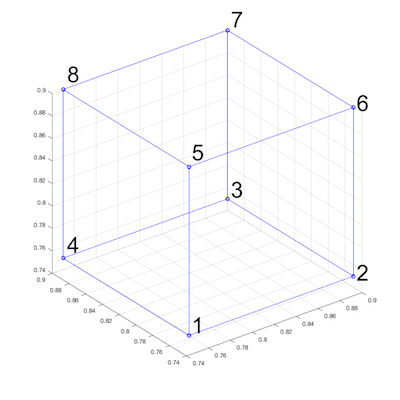

# Build-in geometrical objects in LaMEM

One way to generate an input geometry is to use the build-in geometrical objects in LaMEM. 
These geometries are used if the option 
```
msetup = geom
``` 
is specified in the input file.

A number of geometric primitives exists within LaMEM, and can be combined, with the ones further down in the input scripts overwriting earlier ones. This allows you, for example, to first set a halfspace cooling temperature for the lithosphere and afterwards defined the crust, mantle lithosphere etc.

The following objects are available:

### Sphere
Specifying a sphere comes with the following options:
```
<SphereStart>
    phase       = 1
    radius      = 1.5
    center      = 1.0 2.0 3.0
    
    Temperature = constant # optional: Temperature of the sphere. possibilities: [constant]
    cstTemp     = 1000     # required in case of [constant]: temperature value [in Celcius in case of GEO units]
<SphereEnd>
```

### Layer
Allows you to specify a horizontal layer in the model
```
<LayerStart>
    phase       = 1
    top         = 5.0
    bottom      = 3.0
    
    # optional: sinusoidal perturbations
    cosine      = 0         # optional: add a cosine perturbation on top of the interface (if 1)
    wavelength  = 1         # required if cosine: wavelength in x-direction
    amplitude   = 0.1       # required if cosine: amplitude of perturbation         
	
    # optional: temperature structure
    Temperature = halfspace # optional: Temperature structure. possibilities: [constant, linear, halfspace]
    cstTemp     = 1000      # required in case of [constant]: temperature value [in Celcius in case of GEO units]
    topTemp     = 0         # required in case of [linear,halfspace]: temperature @ top [in Celcius in case of GEO units]
    botTemp     = 1300      # required in case of [linear,halfspace]: temperature @ bottom [in Celcius in case of GEO units]
    thermalAge  = 70        # required in case of [halfspace]: thermal age of lithosphere [in Myrs if GEO units are used]
<LayerEnd>
```

### Box
Allows you to define a square box:
```
<BoxStart>
    phase       =   1		    # required; phase of box
    bounds      =   0 1 0 1 0 1	# required: left right front back bottom top 

    Temperature =   linear      # optional: Temperature structure. possibilities: [constant, linear, halfspace]
    cstTemp     =   1000        # required in case of [constant]: temperature value [in Celcius in case of GEO units]
    topTemp     =   0           # required in case of [linear,halfspace]: temperature @ top [in Celcius in case of GEO units]
    botTemp     =   1300        # required in case of [linear,halfspace]: temperature @ bottom [in Celcius in case of GEO units]
    thermalAge  =   70          # required in case of [halfspace]: thermal age of lithosphere [in Myrs if GEO units are used]
<BoxEnd>
```


### Hexahedral

Allows you to define a hexahedral object (which requires you to specify 8 edge points), in the following order:



```
<HexStart>
    phase   = 1             # required; phase of box
    
    # required: coordinates of the 8 edge points 
    coord   = 0.75 0.75 0.75   0.9 0.75 0.75   0.9 0.9 0.75   0.75 0.9 0.75   0.75 0.75 0.9   0.9 0.75 0.9   0.9 0.9 0.9   0.75 0.9 0.9  	
<HexEnd>
```


### Cylinder
Allows you to insert a cylinder-like object:
```
<CylinderStart>
    phase       = 1             # required; phase of box
    radius      = 0.3           # required: radius of cylinder
    bottom      = 0.1           # required: z-coordinate of bottom of the layer
    base        = 0.1 0.1 0.1   # required: (x,y,z)-coordinate of point at base of cylinder
    cap         = 0.1 0.1 0.8   # required: (x,y,z)-coordinate of point at cap of cylinder

    Temperature = constant      # optional: Temperature of the sphere. possibilities: [constant]
    cstTemp     = 1000          # required in case of [constant]: temperature value [in Celcius in case of GEO units]
<CylinderEnd>
```

### Ellipsoid
```
<EllipsoidStart>
    phase       = 1
    axes        = 2.0 1.5 1.0  # semi-axes of ellipsoid in x, y and z
    center      = 1.0 2.0 3.0
    
    Temperature = constant     # optional: Temperature of the sphere. possibilities: [constant]
    cstTemp     = 1000         # required in case of [constant]: temperature value [in Celcius in case of GEO units]
<EllipsoidEnd>
```


## Pro and contra of using this to create input geometries
One of the advantages of this way of creating a LaMEM input file is that it sets the input geometry in the same file as all other options. An additional advantage is that you don't have to recreate the input geometry of the model if you change the resolution or the number of particles/cell.  

One of the disadvantages is that it is sometimes more tedious to create the geometry, in  particular if you have complicated setups in which you employ data from other sources (say Moho map).

For these reasons, additional methods exists to generate input geometries: 

1) By directly setting the properties of the markers with MATLAB/Octave scripts.
   
2) By using [geomIO](https://geomio.bitbucket.io) to create model setups 