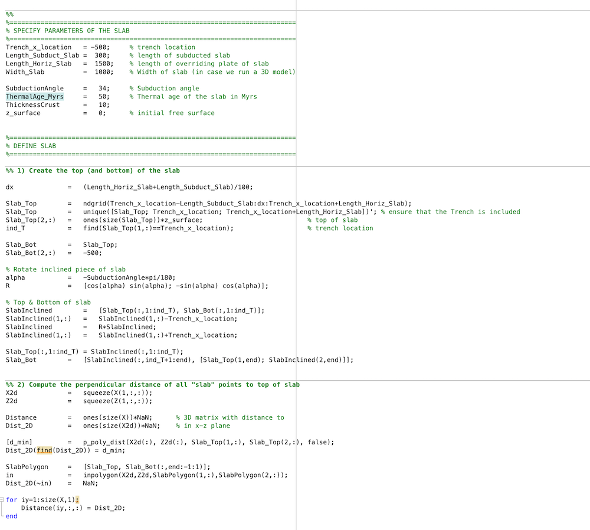

[TOC]
# 3.2 Generating a model setup from MATLAB/Octave

In many cases, generating a model setup from within the LaMEM input file using build-in geometries is insufficient and we would like to have more control on what we are doing & create more complicated setups.

One way to do this is to use a MATLAB/Octave script to generate the model setup. We have provided example files in `/input_models/SubductionWithParticles/`, as well as in some of the test directories.

Depending on whether your LaMEM simulation will run in parallel or not there are two different approaches: 

1. Create the full setup on one processor. For this, the matlab scripts should be placed in the same directory as the LaMEM `(*.dat)` input script. 

2. By creating a `parallel partitioning file` which allows creating a parallel input file. With this method, every processor of a parallel LaMEM simulation only reads in the piece of the input geometry it needs. This method is scalable to very high resolutions, but requires you to run LaMEM first to create the partitioning file.   
   
If you start with a new setup/project, we recommend that you first generate the input file on one processor, and look at it using Paraview (approach 1). Once you are happy with it, you can proceed with approach 2.

Let's have a look at how these two approaches work, using the input files in `/input_files/SubductionWithParticles` as an example.

The files in this directory create a setup for a subduction model with free slip and no temperature (first case) or with temperature-dependent properties (second example).

### 3.2.1. Generate the input on a single processor

The file `CreateMarkers_Subduction_Linear_FreeSlip_parallel.m` gives an example of how we can generate an input file on one processor.

At the beginning we need to set the directories such that MATLAB/Octave knowns where the matlab scripts are that it needs:
```
addpath('../../matlab')
```
This may have to be changed if you are in a different directory.

To generate the setup on one processor, please make sure that the following flag is set to zero:
```
LaMEM_Parallel_output  =    0;
```
You also need to specify the LaMEM input file with:
```
LaMEM_input_file        =   'Subduction2D_FreeSlip_MATLABParticles_Linear_DirectSolver.dat';
```
Once this is done, it reads the LaMEM input file to figure out the size of the computational domain, the number of elements employed in every direction as well as the number of particles in every direction. It also generates a 3D grid, which is all done with this function:
```
[Grid,X,Y,Z,npart_x,npart_y,npart_z,W,L,H] =   LaMEM_ParseInputFile(LaMEM_input_file);
```
You can use the `X,Y,Z` grid later to create your input geometry. Within the MATLAB script, the following 3D arrays are created:
``` 
Phase : contains the phase or rock-type at every point in the grid 
Temp  : contains the temperature in degrees Celcius @ every point in the grid
```

After reading the dimensions of the grid, we use various ways to create the setup. 

In this specific example, we actually generate a polygon and use the command `inpolygon` to figure out which of the 3D points are located within the polygon to specify where the slab is. 
At the end of the file, we save the markers to disk with
```
FDSTAGSaveMarkersParallelMatlab(A,Parallel_partition);
```
which will put the marker files in the directory `/markers`. 
Within the LaMEM input file, you indicate that this directory should be used with
```
msetup          =   files            
mark_load_file  =   ./markers/mdb     # marker input file (extension is .xxxxxxxx.dat)
```

Moreover, we also create a 3D output file `VTK_ModelSetup_paraview_binary.vtr` that we can open with Paraview:
```
FDSTAGWriteMatlab2VTK(A,'BINARY'); % default option
```
Doing that is useful as it allows you to build the setup without having to run the LaMEM model.

Once you are happy, you can run LaMEM on one processor with
```
../../bin/opt/LaMEM -ParamFile Subduction2D_FreeSlip_Particles_Linear_DirectSolver.dat
```

Interested in how to do the same on >1 processor? 
Keep on reading...

### 3.2.2. Generating parallel input using partitioning files

Generating parallel input files involves 3 steps:
1. Create a **ProcessorPartitioning** file for a specific number of processors, which basically tells how LaMEM divides the computational box over the various processors.
2. Run the MATLAB script that generates the input geometry file, using this **ProcessorPartitioning** file as input. In this case, you will have set the option `LaMEM_Parallel_output = 1` in the MATLAV script.
3. Run the LaMEM simulation in parallel, using the same number of processors as used to create the partitioning file.  

In the following we will describe the 3 steps with an example. We will assume that you are happy with generating the setup on one processor (see above). The matlab example file we will be using is

```
/input_models/SubductionWithParticles/CreateMarkers_Subduction_Tdependent_FreeSurface_parallel.m
```

#### 3.2.2.1 Create the partitioning file

Make sure that you are in the correct directory:
```
$ cd /input_models/SubductionWithParticles
$ ls
CreateMarkers_Subduction_Linear_FreeSlip_parallel.m                     Subduction2D_FreeSurface_MATLABParticles_Nonlinear_DirectSolver.dat
CreateMarkers_Subduction_Tdependent_FreeSurface_parallel.m              Subduction3D_FreeSlip_MATLABParticles_Linear_Multigrid.dat
Makefile                                                                Tests
README                                                                  p_poly_dist.m
Subduction2D_FreeSlip_Particles_Linear_DirectSolver.dat
```
We will use the file Subduction2D_FreeSurface_MATLABParticles_Nonlinear_DirectSolver.dat as LaMEM file.

First, run this file with LaMEM, but with the added command-line parameter `-mode save_grid`
```
$ mpiexec -n 4 ../../bin/opt/LaMEM -ParamFile Subduction2D_FreeSurface_MATLABParticles_Nonlinear_DirectSolver.dat -mode save_grid
```
This will generate a processor partitioning file as follows:
```
$ mpiexec -n 4 ../../bin/opt/LaMEM -ParamFile Subduction2D_FreeSurface_MATLABParticles_Nonlinear_DirectSolver.dat -mode save_grid
-------------------------------------------------------------------------- 
                   Lithosphere and Mantle Evolution Model                   
     Compiled: Date: Oct 25 2020 - Time: 14:02:58           
-------------------------------------------------------------------------- 
        STAGGERED-GRID FINITE DIFFERENCE CANONICAL IMPLEMENTATION           
-------------------------------------------------------------------------- 
Parsing input file : Subduction2D_FreeSurface_MATLABParticles_Nonlinear_DirectSolver.dat 
   Adding PETSc option: -snes_ksp_ew
   Adding PETSc option: -js_ksp_monitor
Finished parsing input file : Subduction2D_FreeSurface_MATLABParticles_Nonlinear_DirectSolver.dat 
--------------------------------------------------------------------------
Scaling parameters:
   Temperature : 1000. [C/K] 
   Length      : 1000. [m] 
   Viscosity   : 1e+20 [Pa*s] 
   Stress      : 1e+09 [Pa] 
--------------------------------------------------------------------------
Grid parameters:
   Total number of cpu                  : 4 
   Processor grid  [nx, ny, nz]         : [4, 1, 1]
   Fine grid cells [nx, ny, nz]         : [256, 2, 64]
   Number of cells                      :  32768
   Number of faces                      :  115328
   Maximum cell aspect ratio            :  1.17188
   Lower coordinate bounds [bx, by, bz] : [-1500., -10., -660.]
   Upper coordinate bounds [ex, ey, ez] : [1500., 10., 40.]
--------------------------------------------------------------------------
Saving processor partitioning ... done (0.000728846 sec)
--------------------------------------------------------------------------
```

If you look again at the content of the directory, you will see that a new file is generated:
```
$ ls
CreateMarkers_Subduction_Linear_FreeSlip_parallel.m                     Subduction2D_FreeSlip_Particles_Linear_DirectSolver.dat
CreateMarkers_Subduction_Tdependent_FreeSurface_parallel.m              Subduction2D_FreeSurface_MATLABParticles_Nonlinear_DirectSolver.dat
Makefile                                                                Subduction3D_FreeSlip_MATLABParticles_Linear_Multigrid.dat
ProcessorPartitioning_4cpu_4.1.1.bin                                    Tests
README                                                                  p_poly_dist.m
```
`ProcessorPartitioning_4cpu_4.1.1.bin` is the processor partitioning file, which we need to indicate in the matlab/octave script.
If you generate the file on a different number of processors, or use different box-sizes, the naming of the partitioning file will be different.
Note that on linux, you can always get info about the date when a file was added with:
```
$ ls -al Proc*
-rw-r--r--  1 kausb  admin  2668 Oct 26 15:56 ProcessorPartitioning_4cpu_4.1.1.bin
```
This will allow you to see which partitioning file was added most recently.

#### 3.2.2.2 Run the MATLAB/Octave script 
Next, open the file `CreateMarkers_Subduction_Tdependent_FreeSurface_parallel.m` and make sure that the following parameters are activated/set:
```
LaMEM_Parallel_output   =    1;
LaMEM_input_file        =   'Subduction2D_FreeSurface_MATLABParticles_Nonlinear_DirectSolver.dat';
Parallel_partition      =   'ProcessorPartitioning_4cpu_4.1.1.bin'
```
Once you run this file in MATLAB or Octave, it should give the following output:
```
>> CreateMarkers_Subduction_Tdependent_FreeSurface_parallel
Creating setup in parallel using LaMEM file: Subduction2D_FreeSurface_MATLABParticles_Nonlinear_DirectSolver.dat

Parallel_partition =

    'ProcessorPartitioning_4cpu_4.1.1.bin'

Writing Appended data for binary output in Paraview ... 
Writing file -> ./markers/mdb.00000000.dat
Writing file -> ./markers/mdb.00000001.dat
Writing file -> ./markers/mdb.00000002.dat
Writing file -> ./markers/mdb.00000003.dat
```
which shows that it created marker files for 4 processors.


If you open the file `VTK_ModelSetup_paraview_binary.vtr` in Paraview, it should look like:


Which is a subduction setup as in the example before, but this time with a halfspace cooling thermal age. 

#### 3.2.2.3 Perform the parallel LaMEM simulation
Once you successfully created the marker files, you can run the LaMEM simulation in parallel with:
```
mpiexec -n 4 ../../bin/opt/LaMEM -ParamFile Subduction2D_FreeSurface_MATLABParticles_Nonlinear_DirectSolver.dat
```

Please remember that you need to re-generate the partitioning file if you:
1. Change the number of elements in any of the directions
2. Change the number of particles/element
3. Change the dimensions of the grid (length, width, bottom, etc.)

If you only change the internal geometry or, say, the temperature of the slab, you do **not** need to redo the partitioning file.
Simply rerunning the matlab script is ok in that case. 


### 3.2.3. Understanding the input scripts

The MATLAB/Octave input scripts consists of several parts.

In the beginning you specify the filenames, whether the input should be in parallel or not and (if applicable) the name of the partitioning file (all in red): 


In the next part, the user can do whatever to set the initial geometry. In this particular example, we create a 2D array that computes the distance of a point to the top of the slab. We also create a 2D polygon that described the slab but is set to `NaN` outside. 



The following part first defines the `Phase` and `Temp` 3D arrays, and sets the phases based on the distance towards the top of the slab. We use a halfspace cooling temperature profile with a thermal age of 50 Myrs in this case.


In other scripts you will always have to define and set the properties of these two 3D arrays in one way or the other (how you do it, is up to you).

Finally, we save the data to LaMEM marker files and write a VTK output file:


This last part is the same for all scripts and should not be modified.


