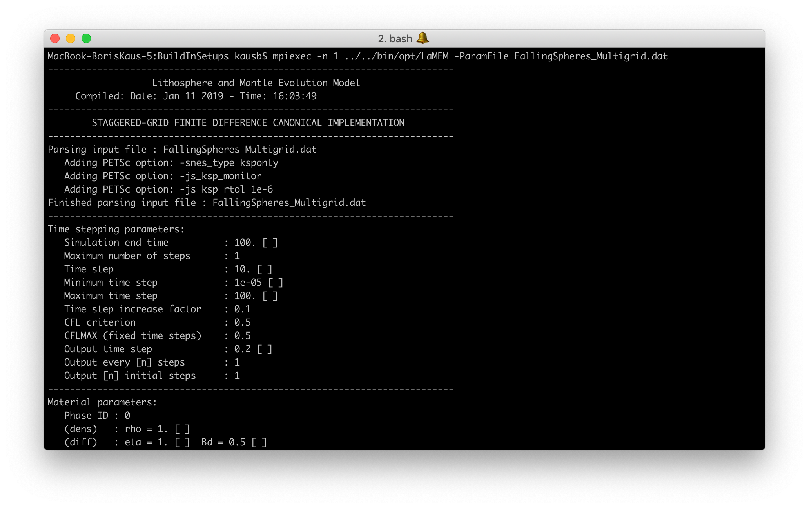
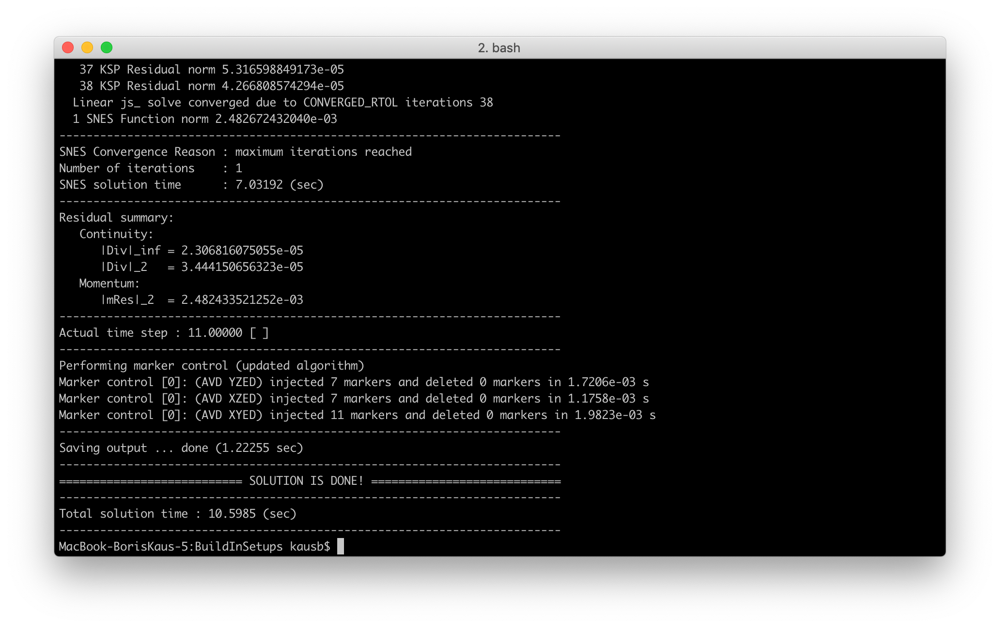
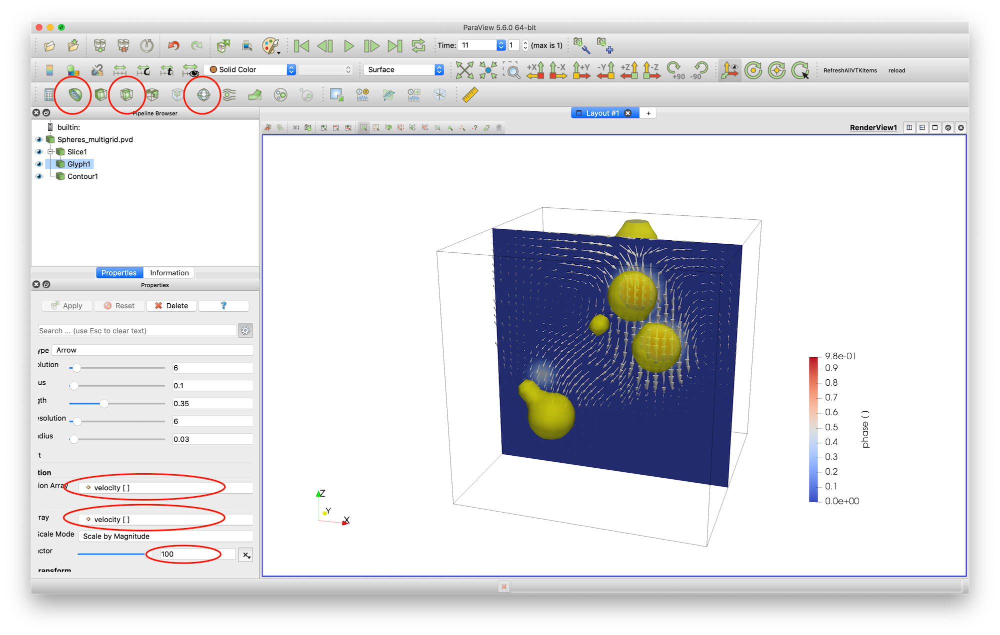
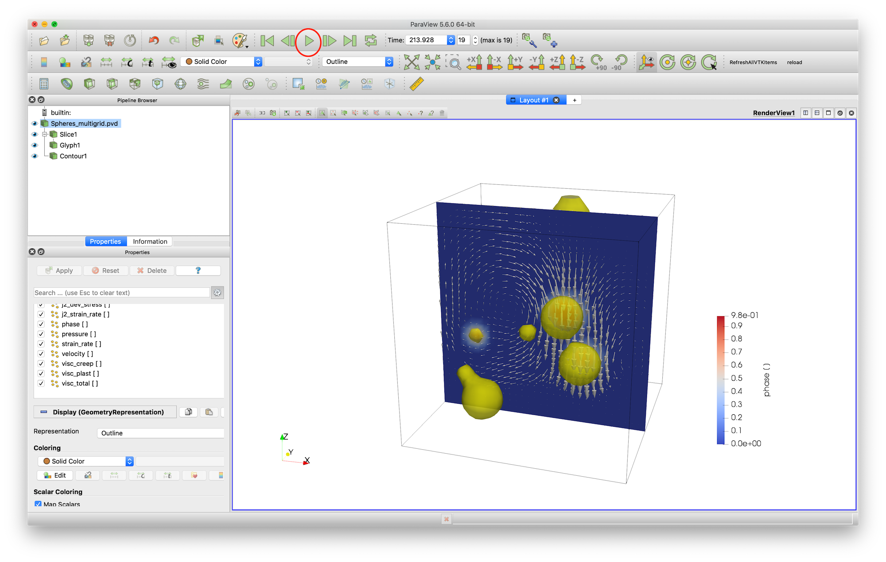
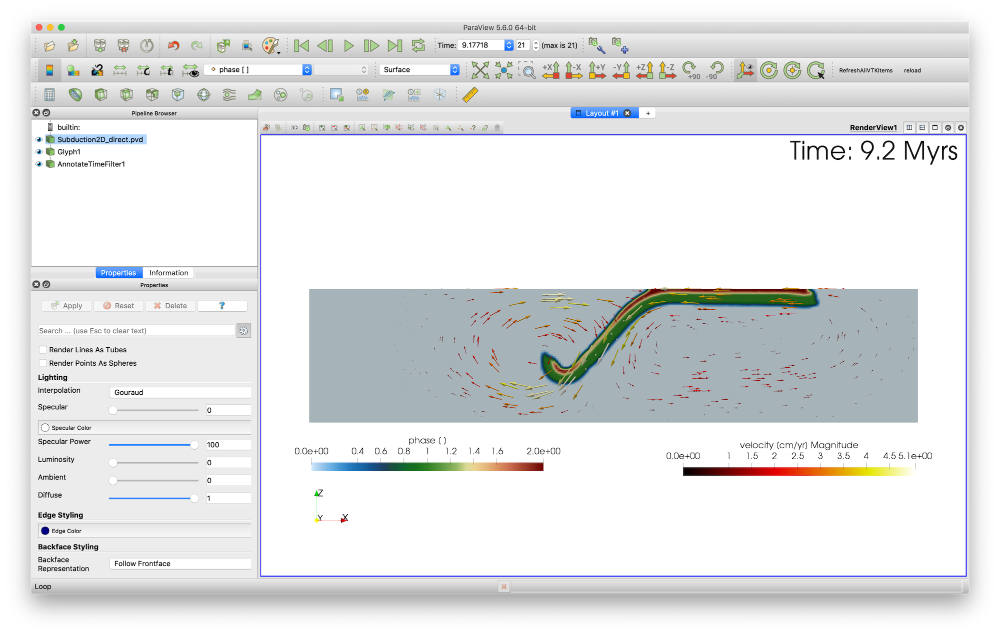
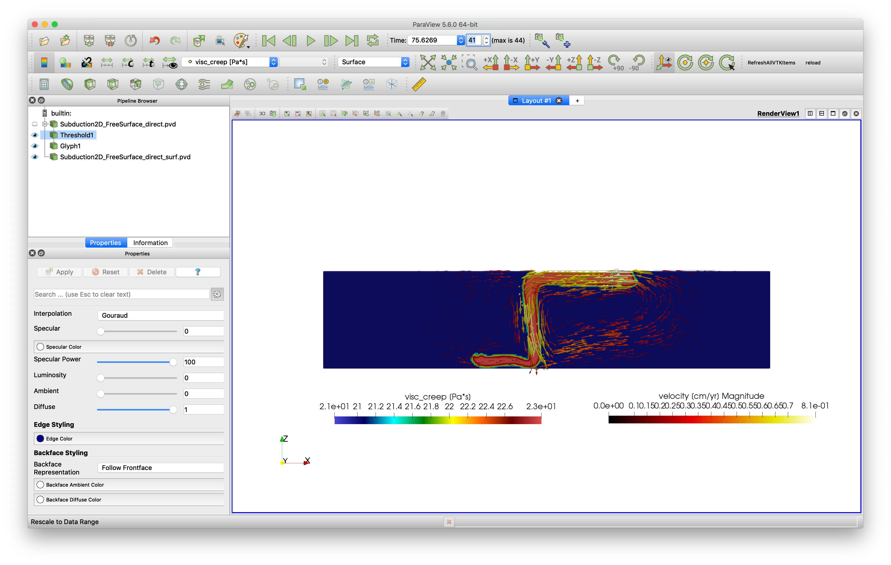

# 2. Getting started

Now that PETSc is installed and LaMEM compiled, it is time to do your first simulation. 
We will look at the sinking of a few high-density spheres in a lower density fluid, followed by a few examples of more complicated setups.

## 2.1 Running the first simulation

First, switch to the correct directory:
```
$ cd /input_models/BuildInSetups
```
after which you can run the simulation with the optimized version of LaMEM as follows:

```
$ mpiexec -n 1 ../../bin/opt/LaMEM -ParamFile FallingSpheres_Multigrid.dat
```

The model output should look like this:
 
and finish with:
 

After the simulation, you will two new ```*.pvd``` files in the directory, and two additional directories that contain info about the timesteps:

```
Spheres_multigrid.pvd
Spheres_multigrid_phase.pvd
Timestep_00000000_0.00000000e+00
Timestep_00000001_1.10000000e+01
```


Running the simulation in parallel is done with: 

```
$ mpiexec -n 4 ../../bin/opt/LaMEM -ParamFile FallingSpheres_Multigrid.dat
```

## 2.2 Visualizing results
The LaMEM output produces VTK-files. We usually use [Paraview](https://www.paraview.org) to visualize those. Open the file in paraview and open the file ```Spheres_multigrid.pvd```.

The result looks like this
 
In order to produce this picture, we used the "Slice", "Glyph" and "Contour" tools (everything you need is circled in red).


## 2.3 Changing input parameters
Let's change a few input parameters and have a look at the LaMEM input file. Open it ```FallingSpheres_Multigrid.dat``` with a text editor and have a look at it. 

### 2.3.1 Running the simulation for longer
Changing the number of timesteps is done with the parameter ```nstep_out```. There are two ways to run the simulation for longer

1) Change the parameter in the input file, save it and rerun the simulation
```
nstep_out = 19     # save output every n steps
```

2) Add the parameter ```-nstep_out 19``` to the command-line and run the simulation with:
```
$ mpiexec -n 4 ../../bin/opt/LaMEM -ParamFile FallingSpheres_Multigrid.dat -nstep_out 19
```
In fact, most input parameters in the LaMEM input file can be set from the command-line as well.

Note that simulations run either until the number of requires timesteps are reached, or until the computed time becomes larger than ```time_end```.
 
After the simulation finishes, you can copy the timesteps and the ```*.pvd``` files to your local computer and reload the ```Spheres_multigrid.pvd``` files within Paraview (File -> Reload Files). Animate all timesteps with the green play button. At the end of the simulation, it'll look like:

 


*Hint on using Paraview:* If you create a visualization in Paraview, you can safe it as a "Statefile", using File->Save State. For the next simulation, you can load this with File->Load State and choose the directory where the input files are. That save quite a bit of work and allows you to make reproducable figures.

*Hint on visualizating LaMEM simulations:* You don't have to wait until a LaMEM simulation is finished. The ```*.pvd``` files are continuously updated, so make sure to copy over these files as well as all timestep directories and hit "Reload".

### 2.3.2 Changing the material properties of the spheres

Next, let's change the viscosity of the spheres. For this, scroll towards the end of the input file until the following section:
```
#===============================================================================
# Material phase parameters
#===============================================================================

	# Define properties of matrix
	<MaterialStart>
		ID  = 0 # phase id
		rho = 1 # density
		eta = 1 # viscosity
	<MaterialEnd>

	# Define properties of spheres
	<MaterialStart>
		ID  = 1   # phase id
		rho = 2   # density
		eta = 1000 # viscosity
	<MaterialEnd>
```
In this simulation, the matrix has Phase ID=0 and the spheres have ID=1. Obviously, the matrix has viscosity and density both equal to 1 and the spheres have a higher viscosity (1000) and higher density (2).  
You can change the viscosity of the spheres by changing the according numbers in the input file and rerunning the simulation.

*Note:* This particular simulation is performed in non-dimensional units, as ```units = none``` in the parameter-file. LaMEM can also use ```units=si``` or ```units=geo```, where the last one is most convenient if performing geodynamic simualtions (as length scales are in km, and timescales in Myrs). Later in the tutorial you will learn more about this.


## 2.4 Exercises
If you are a new user of LaMEM, the best way for you to get familiar with the code is to do a few exercises. The ones below will also give you a bit of info about LaMEM along the way. All exercises employ the build-in geometry options of LaMEM (implying that the input model geometry is constructed with geometrical objects that are specified in the input file). All input files we will discuss are in the directory ```/input_files/BuildInSetups```.

## 2.4.1 Exercise A: Falling Block
Run the Falling Block direct test from the build in setups (```/BuildInSetups/FallingBlock_DirectSolver.dat```) and inspect the input file with a text editor to get a feeling for the parameters that are specified there. 

This example uses a socalled **direct** solver, which the recommended method for 2D setups as it is more robust in cases with large viscosity contrasts. Yet, it is too slow for large 3D simulations, which will require "multigrid" solvers (that unfortunately don't work always very well with large viscosity contrasts and require somewhat more tuning and expertise). PETSc itself does not have build-in parallel direct solvers, but you can install PETSc with SUPERLU_DIST and MUMPS which are two packages that. LaMEM automatically uses those if they are available.

Once the simulation is finished, it should give a setup that is fairly similar to the falling spheres discussed above, but with a square block.

## 2.4.2 Exercise B: Falling Block + different blocks
Change the input file (and save it under a new name, to not confuse GIT later) to include the following features:
* Use a smaller block (0.2 in size in each of the directions). 
* Include a total of 3 blocks, centered around (0.8,0.8,0.8), (0.3,0.3,0.3), and (0.1, 0.3, 0.8) which refer to the (x,y,z) coordinates, respectively.
* Give the 3 blocks a density of 5 and a viscosity of 10.
* Run the simulation for 20 timesteps. 

Try to reproduce this; the result should look like this:


Note that in this visualiation, the blocks look a bit rounded as the resolution of the simulation was quite low.

## 2.4.3 Exercise C: Falling Block + multigrid 
The direct solver, we used sofar, is fine for low resolutions but not for higher ones. For those, you will want to use a **multigrid** solver instead. In LaMEM, this can be done by specifying ```solver = multigrid``` in the input file.
Run the Falling block multigrid test by running ```/BuildInSetups/FallingBlock_Multigrid.dat```. 

The section in the input file that deals with this is:

```
#===============================================================================
# Solver options
#===============================================================================
	SolverType 			=	multigrid  	# solver [direct or multigrid]
	MGLevels 			=	4			# number of MG levels [default=3]
	MGSweeps 			=	10			# number of MG smoothening steps per level [default=10]
	MGSmoother 			=	chebyshev 	# type of smoothener used [chebyshev or jacobi]
	MGCoarseSolver 		=	mumps 		# coarse grid solver [direct/mumps/superlu_dist or redundant - more options specifiable through the command-line options -crs_ksp_type & -crs_pc_type]
```

And LaMEM will print the following statements
```
Preconditioner parameters:
   Matrix type                   : monolithic
   Preconditioner type           : coupled Galerkin geometric multigrid
   Global coarse grid [nx,ny,nz] : [4, 4, 4]
   Local coarse grid  [nx,ny,nz] : [4, 2, 2]
   Number of multigrid levels    :  4
```
What this states is that we use 4 levels of multgrid. Our finest resolution is given by the ```nel_x, nel_y, nel_z``` at the beginning of the file (32,32,32 in this example).
The next coarser grid will be (16,16,16), followed by (8,8,8) and the coarsest resolution is (4,4,4).
Multigrid solves the governing equations at these different grids, and uses a direct solver (e.g., MUMPS) on the coarsest grid. Unfortunately, it is slightly more tricky to set up and use, and you will have to experiment a bit with the number of smoothening steps used at every level and the number of multigid levels that you employ. 

What is important in typical geodynamic simulations is that the coarse grid should be able to "feel" the viscosity structure, so having an extremely coarse grid doesn't work all that well. If your coarse grid is too large, on the other hand, the coarse grid solution will start dominating the computational time, which is also not what you want. Experimenting with this is thus important for real setups. 

*Hint:* You can add the command-line option `-log_view` to get a detailed overview of your simulation, and the time spend on each of the levels. This will be shown at the end of the simulatiom. If you wish, you can only run the simulation for a few timesteps by adding the command-line option `-nstep_max 5`.

## 2.4.4 Exercise D: 2D subduction       
The previous exercises were all performed for a non-dimensional setup. Yet, in most geoscience applications it is useful to have your input in units of kilometers, degrees Celcius, stresses in MPa, etc. For this reason, LaMEM has the ```geo``` input units. 
Let's do a subduction simulation to have a look at this, using a 2D example. As the current version of LaMEM 3D-only, we simulate 2D cases by having 2 elements in the y-direction.  

For this, run the dimensional subduction test setup that uses build-in geometries which is called ```/BuildInSetups/Subduction2D_FreeSlip_Direct.dat```. This simulation is a simple viscous subduction setup, with a free slip upper boundary and a plastic crust (such that the plate detaches from the top boundary). The simulation will take a bit longer than some of the previous simulations, but look approximately like this:




## 2.4.5 Exercise E: 2D subduction + free surface
The file ```Subduction2D_FreeSurface_DirectSolver.dat``` is an example of a 2D subduction model with a free surface. Note that in that case, also a paraview file is created that shows the internal free surface (open the file ```Subduction2D_FreeSurface_direct_surf.pvd``` to see that).
The result should look like:



Note that we used "threshold" in paraview to remove the air layer from the simulation.

## 2.4.6 Exercise F: 2D rifting    	
As a next step, we perform a simulation of a 2D rift that forms an asymmetric fault zone/core complex. The setup consists of a lower crust, an upper crust and a sticky air layer to simulate the free surface (represented by an internal free surface).

In this case we have a slightly more complicated setup and use a multigrid solver in a 2D setting. In order to run this example use the file ```/BuildInSetups/Rifting2D_MultigridSolver.dat```.

New compared to previous cases is that we:

* Employ elasticity (by specifying an elastic shear module in the input file)

* Strain soften the friction angle

Depending on the viscosity of the lower crust, you can either get a symmetric or an asymmetric rift. The default simulation will look like this after 25 timesteps:


## 2.4.5 Exercise G: 3D subduction 
For this simulation, it is handy to have a somewhat larger computer that you can use. The input script is called
```Subduction3D_DoubleSubduction_FreeSlip_Multigrid.dat```
