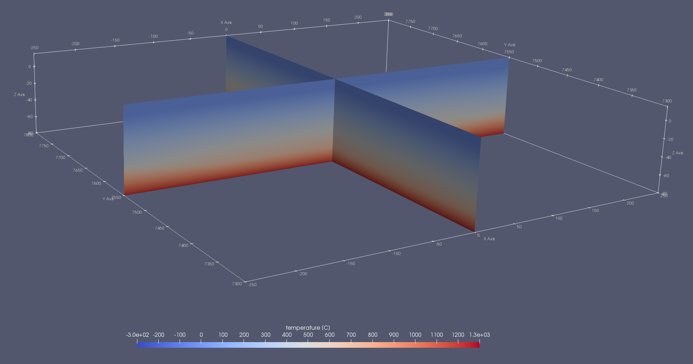
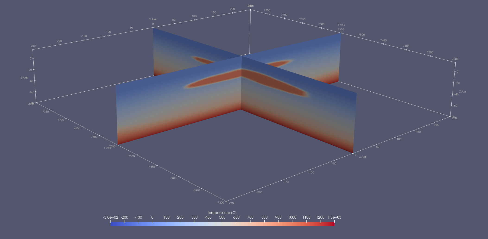

# 3.5 Computing the initial temperature structure

Use the boundary conditions `temp_top` and `temp_bot` as well as `init_temp` to achieve a linear T-profile between top and bottom of your domain. Side boundary conditions are always flux-free.

```
temp_top    = 0
temp_bot    = 1250
init_temp   = 1
```


To get a steady-state temperature distribution depending on the thermal properties of your materials, you need
to specify the thermal parameters `k` and `Cp` for **all** materials and activate the `act_steady_temp` and `act_temp_diff` flag.

```
temp_top        = 0
temp_bot        = 1250
act_steady_temp = 1
act_temp_diff	= 1
...
<MaterialStart>
...
# Thermal parameters	
	k = 3
	Cp = 1000
<MaterialEnd>
```



To assign an independent temperature to a material (like an intruding magma body), set the thermal parameter `T` for **this** material.

```
temp_top        = 0
temp_bot        = 1250
act_steady_temp = 1
act_temp_diff	= 1
...
<MaterialStart>
...
# Thermal parameters	
	T = 980
<MaterialEnd>
```



It is possible to allow for a certain amount of temperature diffusion between the anomalous material and its environment before the start of the forward model by using the `steady_temp_dt` parameter.

```
temp_top        = 0
temp_bot        = 1250
act_steady_temp = 1
act_temp_diff	= 1
steady_temp_dt  = 0.1
...
<MaterialStart>
...
# Thermal parameters	
	T = 980
<MaterialEnd>
```


The right slice shows the temperature distribution with additional diffusion, whereas the left slice shows it without.